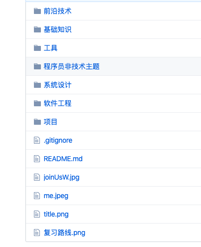
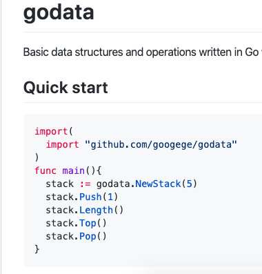

# 作品集锦
[个人简历](./me.pdf)
|作品集锦|地址|描述|截图|
|:---:|:---:|:---:|:---:|
|short 高性能短链接服务|https://short.me|一个使用 GO 编写的高性能短链接服务||
|arrow 秒杀系统|https://arrow.me|一个使用 GO 编写的高性能高并发的秒杀系统||
|GOFamily 后端学习知识框架|https://github.com/googege/GOFamily|以 GO 为工具的后端知识体系，后端必备，架构师必备||
|godata 一个补充go标准库的数据结构项目|https://github.com/googege/godata|heap stack等go标准库本身没有提供的数据结构，godata提供给你||
